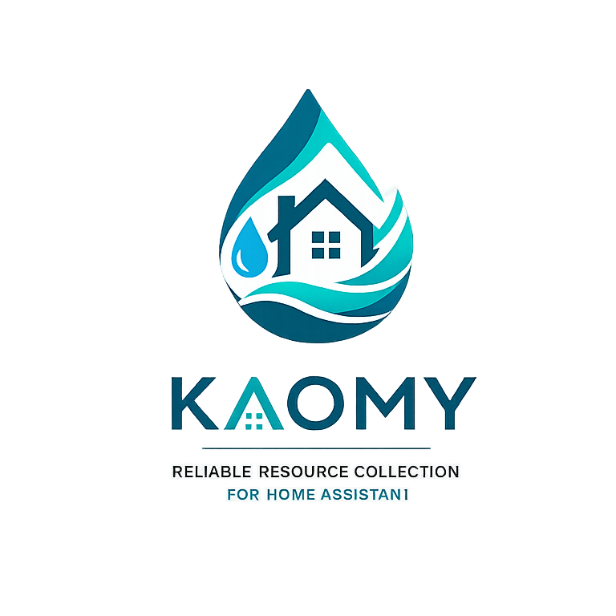
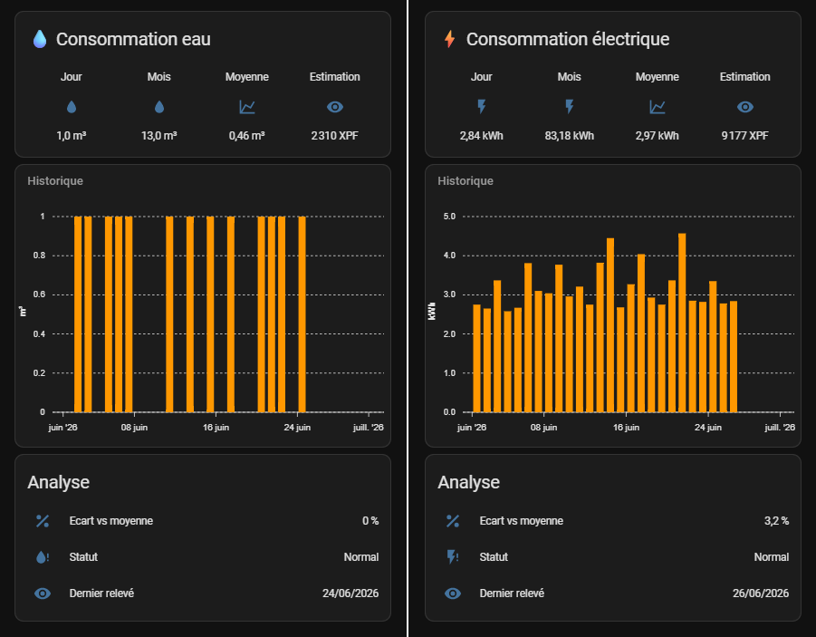

<p align="center">



</p>

<h1 align="center">Kaomy</h1>

<p align="center">

<b>Reliable Resource Collection for Home Assistant</b>

Persistent • Modular • Provider Agnostic • Home Assistant Ready

</p>

<p align="center">


</p>

---

# Overview

Kaomy is a lightweight framework designed to collect, normalize, cache and publish home resource data.


Rather than writing one monolithic script per provider, Kaomy introduces a modular architecture based on Providers, Collectors and a persistent local cache.

The framework is designed to remain simple while being highly extensible.

---

# Features

- Persistent local cache
- Automatic sensor restoration after Home Assistant restart
- Automatic sensor restoration after AppDaemon restart
- Provider / Collector architecture
- Resource normalization
- Home Assistant Statistics compatible
- Home Assistant Energy Dashboard compatible
- ApexCharts compatible
- Modular architecture
- Easily extensible

---

# Current Providers

| Provider | Resource |
|-----------|----------|
| CDE | Water |
| ENERCAL | Electricity |

---

# Current Collectors

| Collector | Resource |
|-----------|----------|
| water_principal | Main water meter |
| power_maison | House electricity |

---

# Architecture

```text
External Provider
        │
        ▼
     Provider
        │
        ▼
   ResourceState
        │
 ┌──────┴──────┐
 │             │
 ▼             ▼
CacheManager SensorManager
 │             │
 └──────┬──────┘
        ▼
 Home Assistant
```

---

# Project Structure

```text
kaomy/
│
├── cache/
├── collectors/
├── core/
├── docs/
├── models/
├── providers/
│
├── README.md
├── LICENSE
└── version.py
```

---

# Home Assistant

Kaomy automatically creates sensors compatible with:

- Recorder
- Statistics
- Energy Dashboard
- ApexCharts

No additional configuration is required.

---

# Configuration

The AppDaemon configuration must be defined in the following file:
/addon_configs/a0d7b954_appdaemon/apps/apps.yaml

After making any changes, make sure to restart AppDaemon and check the logs to ensure everything is running properly.

Example AppDaemon configuration:

```yaml
power_maison:
  module: kaomy.collectors.power_maison
  class: PowerMaisonCollector

  username: CHANGE_ME
  password: CHANGE_ME

  schedule: "03:00:00"

  simulation: false

water_principal:
  module: kaomy.collectors.water_principal
  class: WaterPrincipalCollector

  username: CHANGE_ME
  password: CHANGE_ME

  point_installation_id: CHANGE_ME

  schedule: "02:00:00"

  simulation: false
```

---

# CDE - Finding the point_installation_id

1. Login to the CDE customer portal.
2. Open the Consumption page.
3. Open your browser Developer Tools.
4. Go to the Network tab.
5. Refresh the consumption graph.
6. Locate the request:

```text
GetGraphRelevesData
```

7. Inspect its payload.

Retrieve:

```text
pointDInstallationId
```

Example:

```text
76397
```

Use this value in your AppDaemon configuration.

---

# Triggering an immediate collection

Collectors normally run according to their configured schedule.

For development purposes you can temporarily enable an immediate execution.

Simply uncomment:

```python
self.run_in(self.collect_and_publish, 10)
```

inside the collector.

Example:

```text
collectors/power_maison.py
collectors/water_principal.py
```

Once the cache has been initialized successfully, comment or remove this line.

---

# Security

Never commit:

```text
apps.yaml
cache/*.json
```

Credentials must remain outside the repository.

---

# Screenshot

<p align="center">



</p>

---

# Roadmap

## Version 1.0

- ✅ Persistent cache
- ✅ Resource normalization
- ✅ Home Assistant integration
- ✅ CDE provider
- ✅ ENERCAL provider
- ✅ Water collector
- ✅ Electricity collector

## Next

- Consumption analytics
- Cost analytics
- Solar production
- Battery storage
- Weather integration
- Smart recommendations

---

# Philosophy

Kaomy follows one simple principle.

> **Providers collect data.**

> **Collectors orchestrate.**

> **The Core remains provider agnostic.**

Keeping responsibilities separated makes Kaomy reliable, testable and easy to extend.

---

# Author

Created by **Mataïo** ☕
Powered by coffee and Home Assistant — Nouméa

---

# License

MIT
